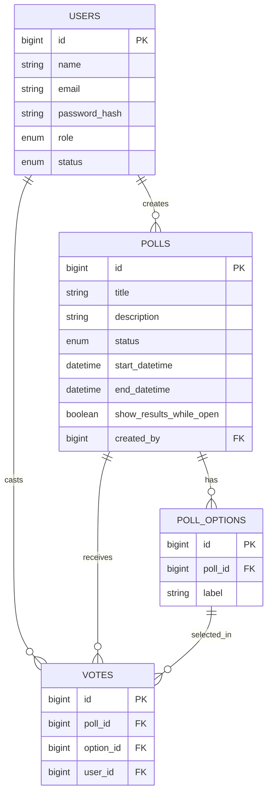

# **Voting App for Clubs/Events**

**Domain:** Campus Life
**Core idea:** Admins create **polls** (e.g., *“Best Performance of the Fest”*). Authenticated users can **vote exactly once per poll**. Admins can **see live/final results**.

---

## 1) Goals & Problem Statement

Build a **full‑stack web app** that allows campus clubs/event organizers to:

* **Create & manage polls** with multiple options.
* **Restrict each user to one vote per poll**.
* **Show real-time or on-demand aggregated results** to Admins (optionally public after poll closes).

---

## 2) Tech Stack (must use)

* **Frontend (choose one):**

  * HTML, CSS, Bootstrap, Vanilla JS **or**
  * React (with React Router)
* **Backend:** Node.js + Express.js
* **Database:** MySQL / MariaDB
* **Must-have libs/concepts:** JWT auth, bcrypt, validation (Joi/Zod/express-validator), migration tool (Sequelize/Prisma/Knex or raw SQL scripts), dotenv
* **Optional / Bonus:** Swagger/OpenAPI docs, Socket.IO for live result updates, Docker, CI, email invites

---

## 3) Roles & Permissions

* **Admin**

  * CRUD polls & options
  * View complete results & voter counts
  * Close polls / publish results
* **User (Student)**

  * View open polls
  * Vote **once per poll**
  * View published results (if allowed)

---

## 4) Core Entities & CRUD

| Entity         | Description                                                                 | CRUD                                                                                                 |
| -------------- | --------------------------------------------------------------------------- | ---------------------------------------------------------------------------------------------------- |
| **User**       | Admin & Students (login + roles)                                            | Admin creates or allow self-register; update profile; soft-delete                                    |
| **Poll**       | A voting event with a title, description, start/end times, visibility flags | Full CRUD (Admin)                                                                                    |
| **PollOption** | Options under a poll                                                        | Full CRUD (Admin)                                                                                    |
| **Vote**       | A user’s vote for one option in a poll                                      | Create (once), Read own, (Admin can read all); no Update/Delete (or allow delete before poll closes) |

---

## 5) Key Functional Rules

1. **One vote per user per poll**
   Enforce with a **unique constraint** `(user_id, poll_id)` in `votes`.
2. **Poll lifecycle**

   * `DRAFT` → `PUBLISHED` (open for voting during window) → `CLOSED`
3. **Time windows**

   * Voting allowed only between `start_datetime` and `end_datetime`.
4. **Visibility**

   * Results visible to Admin always
   * Optional: results visible to users only **after** poll closes or if `show_results_while_open = true`.
5. **Integrity**

   * Votes only accepted for options that belong to the poll.
   * Cannot vote on closed/not-yet-started polls.

---

## 6) REST API (sample)

### Auth

* `POST /api/auth/register` (optional self-register)
* `POST /api/auth/login`
* `GET /api/auth/me`

### Users (Admin)

* `GET /api/users`
* `GET /api/users/:id`
* `PUT /api/users/:id`
* `PATCH /api/users/:id/disable`
* `DELETE /api/users/:id` (soft delete)

### Polls

* `POST /api/polls` (Admin)
* `GET /api/polls?status=&search=&page=&limit=` (Users see only published/open/closed depending on visibility)
* `GET /api/polls/:id`
* `PUT /api/polls/:id` (Admin)
* `PATCH /api/polls/:id/publish` (Admin)
* `PATCH /api/polls/:id/close` (Admin)
* `DELETE /api/polls/:id` (Admin)

### Poll Options

* `POST /api/polls/:pollId/options` (Admin)
* `GET /api/polls/:pollId/options`
* `PUT /api/polls/:pollId/options/:id` (Admin)
* `DELETE /api/polls/:pollId/options/:id` (Admin)

### Votes

* `POST /api/polls/:pollId/votes` (body: { optionId })
* `GET /api/polls/:pollId/votes/me` (user’s own vote)
* `GET /api/polls/:pollId/results` (Admin or public depending on poll flag)

  * Returns aggregated counts per option

---

## 7) Database Schema (MySQL/MariaDB)

```sql
-- users
CREATE TABLE users (
  id            BIGINT PRIMARY KEY AUTO_INCREMENT,
  name          VARCHAR(120) NOT NULL,
  email         VARCHAR(120) NOT NULL UNIQUE,
  password_hash VARCHAR(255) NOT NULL,
  role          ENUM('ADMIN','USER') NOT NULL DEFAULT 'USER',
  status        ENUM('ACTIVE','DISABLED') NOT NULL DEFAULT 'ACTIVE',
  created_at    DATETIME NOT NULL DEFAULT CURRENT_TIMESTAMP,
  updated_at    DATETIME NOT NULL DEFAULT CURRENT_TIMESTAMP ON UPDATE CURRENT_TIMESTAMP,
  deleted_at    DATETIME NULL
);

-- polls
CREATE TABLE polls (
  id                         BIGINT PRIMARY KEY AUTO_INCREMENT,
  title                      VARCHAR(200) NOT NULL,
  description                TEXT NULL,
  status                     ENUM('DRAFT','PUBLISHED','CLOSED') NOT NULL DEFAULT 'DRAFT',
  start_datetime             DATETIME NULL,
  end_datetime               DATETIME NULL,
  show_results_while_open    BOOLEAN NOT NULL DEFAULT FALSE,
  created_by                 BIGINT NOT NULL,
  created_at                 DATETIME NOT NULL DEFAULT CURRENT_TIMESTAMP,
  updated_at                 DATETIME NOT NULL DEFAULT CURRENT_TIMESTAMP ON UPDATE CURRENT_TIMESTAMP,
  deleted_at                 DATETIME NULL,
  FOREIGN KEY (created_by) REFERENCES users(id)
);

-- poll_options
CREATE TABLE poll_options (
  id          BIGINT PRIMARY KEY AUTO_INCREMENT,
  poll_id     BIGINT NOT NULL,
  label       VARCHAR(200) NOT NULL,
  created_at  DATETIME NOT NULL DEFAULT CURRENT_TIMESTAMP,
  updated_at  DATETIME NOT NULL DEFAULT CURRENT_TIMESTAMP ON UPDATE CURRENT_TIMESTAMP,
  deleted_at  DATETIME NULL,
  FOREIGN KEY (poll_id) REFERENCES polls(id)
);

-- votes
CREATE TABLE votes (
  id          BIGINT PRIMARY KEY AUTO_INCREMENT,
  poll_id     BIGINT NOT NULL,
  option_id   BIGINT NOT NULL,
  user_id     BIGINT NOT NULL,
  created_at  DATETIME NOT NULL DEFAULT CURRENT_TIMESTAMP,
  UNIQUE KEY uq_user_poll (user_id, poll_id),
  FOREIGN KEY (poll_id) REFERENCES polls(id),
  FOREIGN KEY (option_id) REFERENCES poll_options(id),
  FOREIGN KEY (user_id) REFERENCES users(id)
);
```

**Aggregation query (example):**

```sql
SELECT o.id AS option_id, o.label, COUNT(v.id) AS votes
FROM poll_options o
LEFT JOIN votes v ON v.option_id = o.id
WHERE o.poll_id = ?
GROUP BY o.id, o.label
ORDER BY votes DESC;
```

---

## 8) ER Diagram (Mermaid)



---

## 9) Validation Rules (examples)

* **Poll**

  * `title` required
  * `status` ∈ {DRAFT, PUBLISHED, CLOSED}
  * `start_datetime < end_datetime` (when provided)
* **PollOption**

  * `label` required
  * Must belong to an existing poll
* **Vote**

  * `option_id` must belong to the given `poll_id`
  * Poll must be `PUBLISHED` and current time within window (if defined)
  * No existing vote for `(user_id, poll_id)` (check before insert; unique constraint enforces)

---

## 10) Frontend Screens

1. **Auth**

   * Login, (optional) Register
2. **Polls (User)**

   * List of open polls
   * Poll detail page with options → vote form (disabled if already voted or poll closed)
   * View my votes
3. **Results**

   * Show counts per option (Admin always; optionally public based on flags)
4. **Admin Panel**

   * Create/Edit/Delete polls
   * Add/Edit/Delete options
   * Publish/Close control
   * Results dashboard (table/chart)
5. **(Optional) Live Results**

   * Auto-refresh (polling) or WebSocket

---

## 11) Non-Functional Requirements

* JWT auth (short-lived access or HTTP-only cookie)
* Password hashing with bcrypt
* Role-based route guards & UI guards
* Input validation (client + server)
* Pagination for poll lists (admin view)
* Unified error response format
* Environment variables (`.env`, `.env.example`)
* Backend unit & integration tests (≥ 60% coverage target recommended)

---

## 12) Suggested Folder Structure

```
/backend
  /src
    /config
    /routes
    /controllers
    /services
    /models (or /db)
    /validators
    /middlewares
    /utils
    app.js
    server.js
  /tests
  swagger.yaml
/frontend
  /src
    /api
    /components
    /pages
    /store or /contexts
    /routes
```

---

## 13) Milestones & **Rotation Plan** (3 members: A, B, C)

> **Duration:** \~4–5 weeks
> **Rule:** Every week, **each member owns one “feature slice” end‑to‑end** (DB → API → UI). Rotate so everyone touches **frontend, backend, DB**.

### Week 1 – Setup & Design

* **All:** SRS, user stories, ER diagram, API contract (Swagger), wireframes, repo setup, lint/format hooks
* **A:** Node/Express skeleton + health route
* **B:** DB setup + migrations tool
* **C:** Frontend scaffold (React/Bootstrap) + router

**Deliverables:** ERD, Swagger/OpenAPI, wireframes, project scaffold

### Week 2 – Auth & Users

* **A (feature slice):** Users table + Auth API (register/login/me) + RBAC middleware
* **B:** Frontend login/register/profile + protected routes
* **C:** Backend tests & validators for auth/users

### Week 3 – Polls & Options

* **B (feature slice):** Polls + PollOptions migrations & CRUD API (publish/close)
* **C:** Admin UI for creating/editing polls & options
* **A:** Integration tests (polls/options) + pagination & error handling

### Week 4 – Votes & Results

* **C (feature slice):** Votes table + API (vote once, get my vote, results aggregation)
* **A:** User voting UI + “You already voted” logic + timer/disabled state
* **B:** Results page (tables/charts) + (optional) live updates via WebSocket

### Week 5 (optional) – Polish, Testing, Deploy

* **All:** E2E UI tests (Cypress/Playwright), code cleanup, docs polish
* **All:** Dockerize & deploy (Render/Railway/VPS) if possible
* **All:** Final report, demo video, slides, contribution log

---

## 14) User Stories (samples)

* **As an Admin**, I can create a poll with multiple options and publish it during an event.
* **As a Student**, I can vote once in a published poll during its active window.
* **As an Admin**, I can see the total votes per option at any time, even before the poll closes.
* **As a Student**, I can view final results after the poll closes (if allowed).

---

## 15) Acceptance Criteria (examples)

**Single vote constraint**

* **Given** a user already voted in poll `P`
* **When** they attempt to vote again
* **Then** the API responds with `409 Conflict` (or similar) and does not create a second vote

**Poll time window**

* **Given** a poll’s `start_datetime` is in the future
* **When** a user tries to vote
* **Then** the API returns `400/403` indicating voting is not yet open

**Results visibility**

* **Given** a poll has `show_results_while_open = false` and status `PUBLISHED`
* **When** a user (non-admin) hits results endpoint
* **Then** they receive `403 Forbidden`

---
